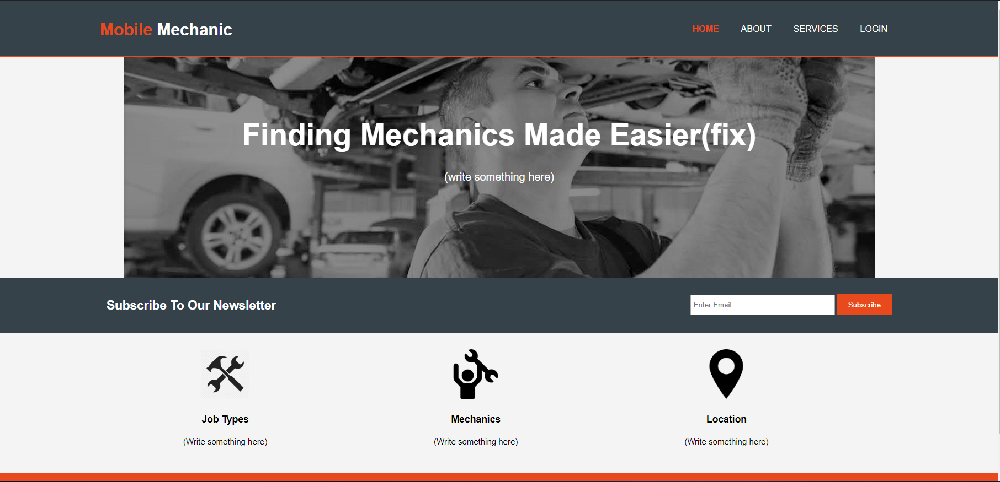
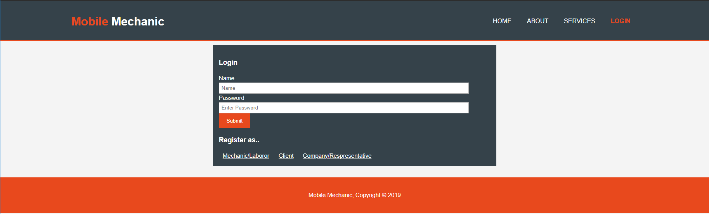

# mobilemechanic

An intent to display a front-end  development about mobil mechanic using HTLM/CSS. Even more drawnt to HTML to 
click and input user's text and provide services from the website.

